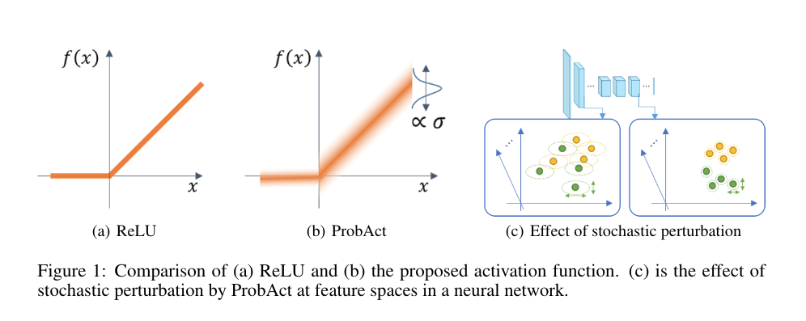
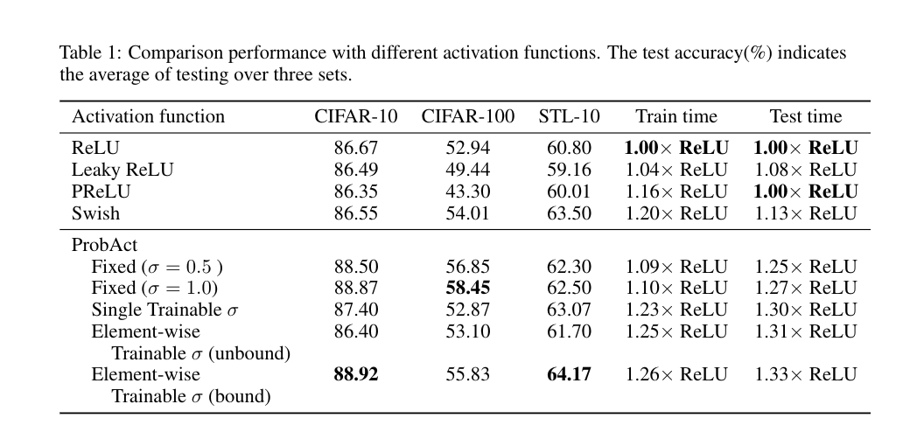
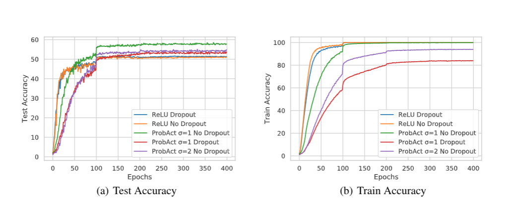

# ProbAct-Probabilistic-Activation-Function

Official PyTorch implementation of the paper : ProbAct: A Probabilistic Activation Function for Deep Neural Networks.


## Why ProbAct

Most of the activation functions currently used are deterministic in nature, whose input-output relationship is fixed. In this work, we propose a probabilistic activation function, called *ProbAct*. The output value of ProbAct is sampled from a normal distribution, with the mean value same as the output of ReLU and with a fixed or trainable variance for each element. In the trainable ProbAct, the variance of the activation distribution is trained through back-propagation. We also show that the stochastic perturbation through ProbAct is a viable generalization technique that can prevent overfitting.

## Accuracy Comparison



## Overfitting Comparison



```

```


